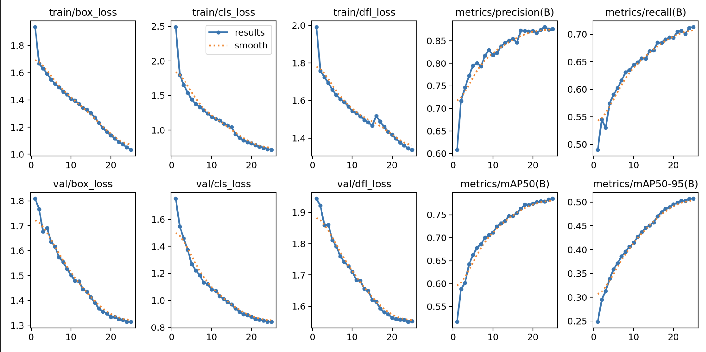
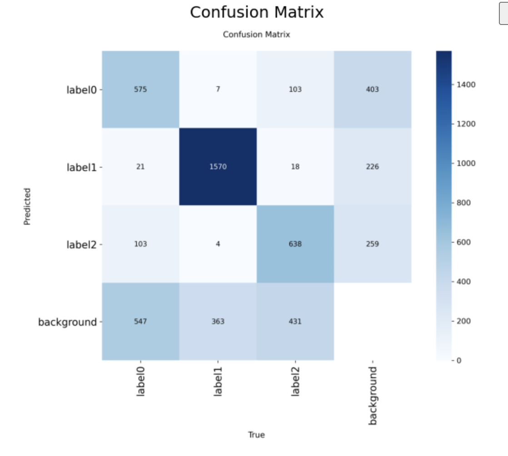
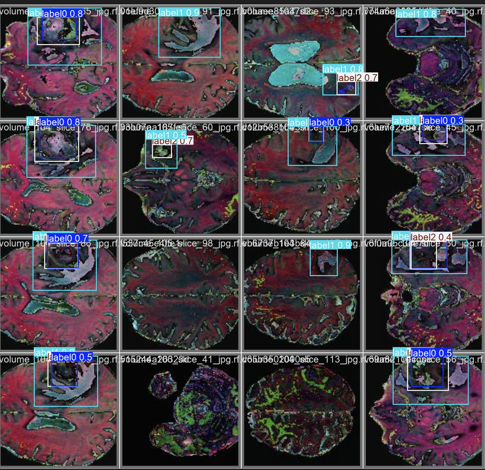

# 🧠 Brain Tumor Detection with YOLOv8


A deep learning object detection pipeline for detecting and classifying brain tumors in MRI scans using YOLOv8 (Ultralytics). The model is trained to identify three clinically significant tumor types: **Glioma**, **Meningioma**, and **Pituitary** tumors.

## 📁 Project Structure

```
mini-project-7/
├── notebooks/
│   ├── notebook.ipynb              # Main project notebook
│   └── -Brain-Tumor-Detection-1/  # Roboflow dataset
│       ├── train/images/
│       ├── valid/images/
│       ├── test/images/
	└── data.yaml
├── runs/detect/brain_tumor_v1/    # Training outputs
│   ├── weights/
│   │   ├── best.pt
│   │   └── last.pt
│   ├── results.csv
│   ├── confusion_matrix.png
│   └── PR_curve.png
├── sample_images/                 # Sample MRI images
└── README.md
```

---

##  Problem Description

Brain tumors are among the most critical and time-sensitive conditions in medicine. Early and accurate detection directly impacts patient survival rates. Manual analysis of MRI scans is time-consuming and subject to human error.

This project builds an **automated object detection system** using YOLOv8 that can:
* Localize tumor regions in MRI scans with bounding boxes
* Classify the tumor type across 3 categories
* Operate at high confidence with measurable precision and recall

### Dataset

| Property | Details |
|----------|---------|
| **Source** | [Roboflow Universe — Brain Tumor Detection](https://universe.roboflow.com/yousef-ghanem-jzj4y/brain-tumor-detection-fpf1f) |
| **Format** | YOLOv8 |
| **Classes** | 3 (Glioma, Meningioma, Pituitary) |
| **Train images** | 20,330 |
| **Validation images** | 1,980 |
| **Test images** | 990 |

### Classes

| ID | Class | Description |
|----|-------|-------------|
| 0 | `glioma` | Tumor in glial cells of the brain |
| 1 | `meningioma` | Tumor in membranes surrounding the brain |
| 2 | `pituitary` | Tumor in the pituitary gland |

---

Brain tumor segmentation from MRI images is a high-impact medical imaging task; accurate detection supports early diagnosis and treatment. Manual annotation by radiologists is time-consuming and subject to variability, motivating automated solutions.

The dataset used for this project was provided by Roboflow (workspace `yousef-ghanem-jzj4y`, project `brain-tumor-detection-fpf1f`, version 1). It comprises labeled MRI images across multiple tumor categories—including glioma, meningioma, pituitary adenoma. Images are organized in YOLO format with `train/`, `valid/`, and `test/` splits.


---

##  Setup & Run Instructions

1. **Clone the repository**
	```bash
	git clone https://github.com/Sepehrman/mini-project-7.git
	cd mini-project-7
	```

2. **Install dependencies**
	```bash
	python -m pip install --upgrade pip
	pip install -r requirements.txt
	# The notebook installs ultralytics and roboflow via pipx for isolation
	```

3. **Open and execute the notebook**
	Launch `notebooks/notebook.ipynb` in JupyterLab, VS Code, or Google Colab. Running the cells sequentially will:
	- download the dataset from Roboflow
	- load a COCO-pretrained `yolov8n.pt` model
	- fine-tune for at least 25 epochs (this parameter may be increased)
	- evaluate on the validation split, reporting mAP@50, mAP@50–95, precision, and recall
	- display per-class metrics, confusion matrix, and sample predictions
	- plot training curves, confidence distributions, and other diagnostics

---

##  Training

The model was fine-tuned from pretrained `yolov8n.pt` weights on the brain tumor dataset.

| Parameter | Value |
|-----------|-------|
| **Model** | YOLOv8n (Nano) |
| **Epochs** | 25 |
| **Image size** | 640×640 |
| **Batch size** | 16 |
| **Confidence threshold** | 0.25 |
| **Early stopping patience** | 10 epochs |

---

##  Results

### Overall Metrics

| Metric | Score |
|--------|-------|
| **mAP@50** | 0.7851 |
| **mAP@50-95** | 0.5073 |
| **Precision** | 0.8761 |
| **Recall** | 0.7130 |

### Per-Class Metrics

| Class | AP@50 | AP@50-95 | Precision | Recall |
|-------|-------|----------|-----------|--------|
| Glioma | 0.7157 | 0.4235 | 0.8276 | 0.6340 |
| Meningioma | 0.8703 | 0.6150 | 0.9076 | 0.8143 |
| Pituitary | 0.7692 | 0.4833 | 0.8931 | 0.6908 |

---

##  Training Curves

Loss and mAP tracked over 25 epochs. Both box loss and classification loss decrease steadily, while mAP@50 and mAP@50-95 improve consistently — indicating healthy convergence with no signs of overfitting.


---

##  Confusion Matrix

The confusion matrix shows per-class prediction accuracy across the validation set. Strong diagonal values indicate the model reliably distinguishes between tumor types.




##  Sample Predictions

YOLOv8 predictions on 6 diverse validation images, sampled evenly across the full validation set to ensure variety.


---

## 🔍 Confidence Threshold Analysis

Detection results at 4 different confidence thresholds (0.10, 0.25, 0.50, 0.75) on the same MRI scan. Lower thresholds are preferred in clinical screening contexts to minimise missed detections.

| Threshold | Use Case |
|-----------|----------|
| 0.10 | Screening — catch everything |
| 0.25 | General detection (default) |
| 0.50 | Balanced precision/recall |
| 0.75 | High-confidence diagnosis support |

---

## 📌 Results: Metrics, Visualizations, Per-Class Analysis

The notebook provides:
* Global evaluation metrics (mAP@50, mAP@50–95, precision, recall)
* Per-class breakdowns with AP and confusion matrix
* Multiple visualizations of predictions and training dynamics
* Comprehensive coverage of the detection pipeline with minimal gaps; additional experiments (longer training, different backbones) can be performed by modifying the training cell.

---

##  Team Member Contributions

* Use YOLO26 (Ultralytics) for all detection tasks  - Ledja Halltari 
* Start from pre-trained COCO weights (YOLOv8) - Sepehr Mansouri 
* Train for a minimum of 25 epochs (experiment with more) - Sepehr Mansouri
* Evaluate with mAP@50, mAP@50-95, precision, and recall - Ledja Halltari & Sepehr Mansouri
* Show per-class metrics and confusion matrix - Ledja Halltari
* Visualize at least 6 prediction examples on validation images - Sepehr Mansouri & Ledja Halltari
* Include training curves (loss and mAP over epochs) - Ledja Halltari & Sepehr Mansouri

---

## Final Model Analysis

The dataset exhibits reasonable class balance across glioma, meningioma, and pituitary tumors, though glioma detection shows the weakest performance with the lowest AP@50 (0.7157) and recall (0.6340), likely due to more variable MRI presentations or fewer distinct features compared to the other classes. For clinical use, a low confidence threshold (0.10-0.25) is recommended for screening to minimize false negatives, as missing tumors is more dangerous than false positives in medical diagnosis. The model struggles most with glioma classification, possibly due to overlapping visual characteristics with other tumors or dataset limitations. In this medical context, false negatives pose greater risk than false positives, as undetected tumors could delay treatment. For business deployment, the model shows promise but is not yet accurate enough for clinical use; improvements would require larger, more balanced datasets, data augmentation, and validation on diverse patient populations to achieve higher reliability.

---

##  References

- [Ultralytics YOLOv8 Documentation](https://docs.ultralytics.com)
- [Roboflow Brain Tumor Detection Dataset](https://universe.roboflow.com/yousef-ghanem-jzj4y/brain-tumor-detection-fpf1f)
- [YOLO: Real-Time Object Detection](https://arxiv.org/abs/1506.02640)