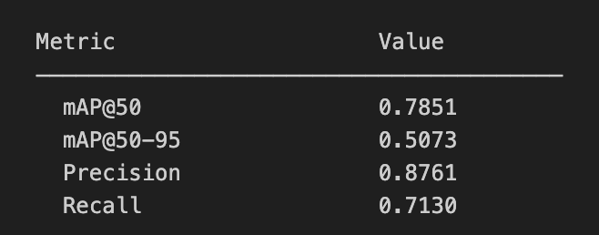
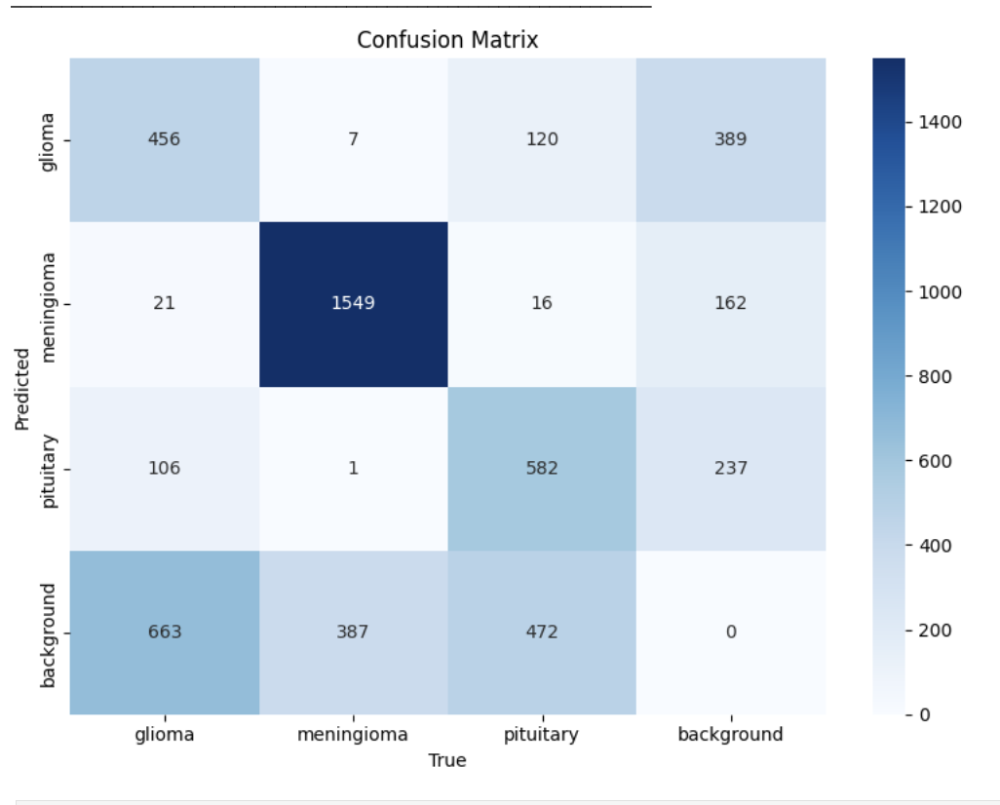
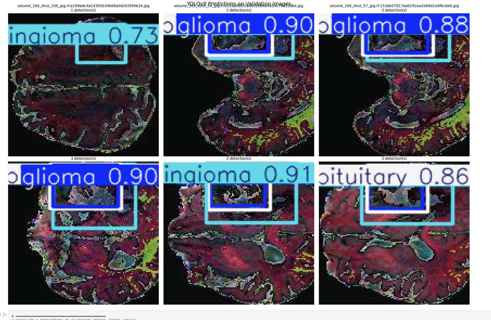
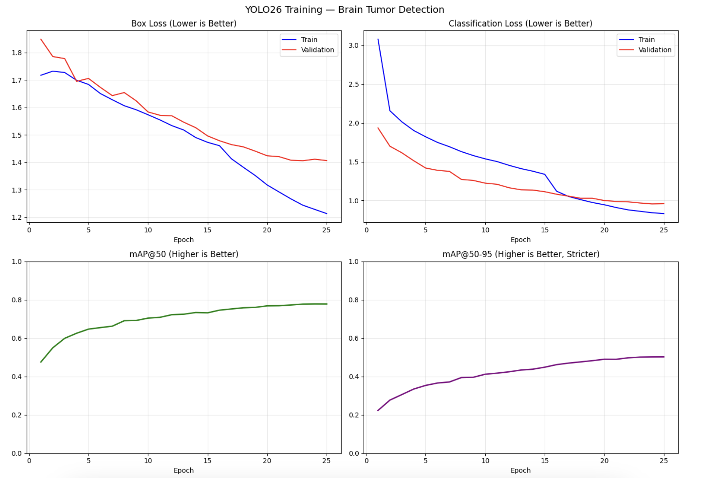
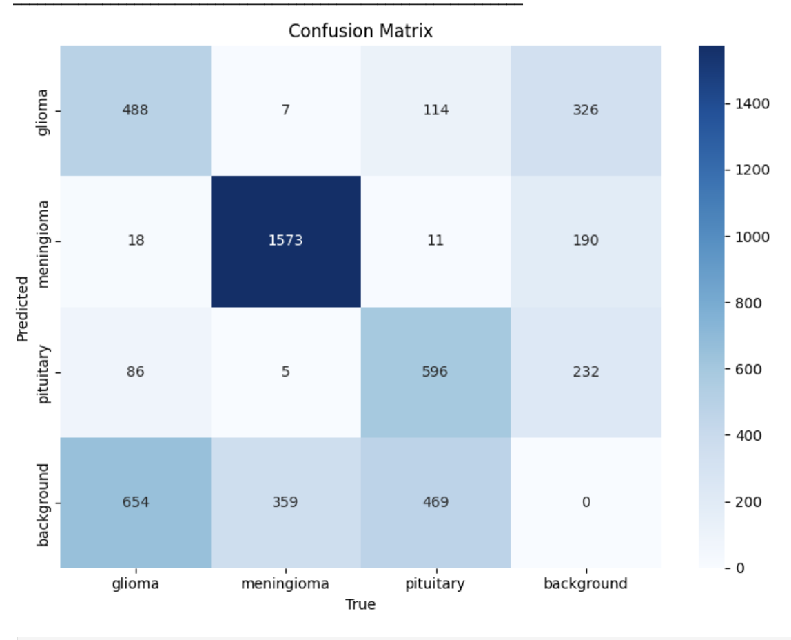
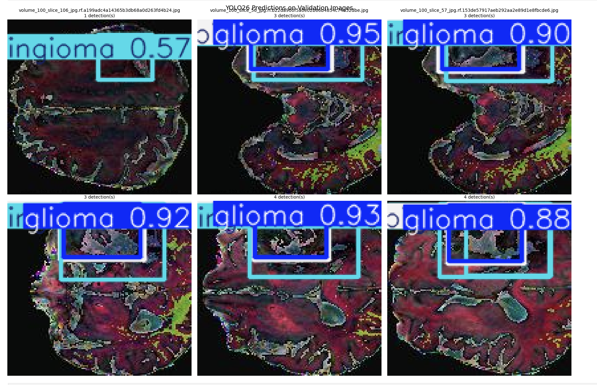

# Brain Tumor Detection with YOLO26

## Problem Description

Brain tumors are abnormal growths of cells within the brain that can be benign or malignant. Early detection and accurate classification of brain tumors is critical for effective treatment planning and improved patient outcomes. This project implements an automated brain tumor detection system using state-of-the-art computer vision techniques to analyze MRI scans and identify different types of brain tumors.

The system focuses on detecting and classifying three main types of brain tumors:
- **Glioma**: Often malignant tumors that originate in glial cells
- **Meningioma**: Typically benign tumors that arise from the meninges
- **Pituitary**: Tumors affecting the pituitary gland

## Dataset Source

The dataset used in this project is sourced from Roboflow Universe, specifically the "Brain Tumor Detection" dataset (version 1) created by Yousef Ghanem. The dataset contains annotated MRI brain scans with bounding box labels for tumor detection.

**Dataset Statistics:**
- **Training images**: 1,170
- **Validation images**: 315
- **Test images**: 307
- **Total images**: 1,792
- **Classes**: 3 tumor types (glioma, meningioma, pituitary)
- **Image format**: JPEG/PNG MRI scans
- **Annotation format**: YOLO format bounding boxes

The dataset is well-balanced across the three tumor classes and provides a comprehensive collection of brain MRI scans suitable for training robust object detection models.

## Setup and Run Instructions

### Prerequisites

- Python 3.8 or higher
- pip package manager
- Git (for cloning the repository)

### Installation

1. **Clone the repository:**
   ```bash
   git clone https://github.com/Sepehrman/mini-project-7.git
   cd mini-project-7
   ```

2. **Install dependencies:**
   ```bash
   pip install -r requirements.txt
   ```

   The key dependencies include:
   - `ultralytics` - YOLO26 implementation
   - `roboflow` - Dataset downloading
   - `numpy` - Numerical computations
   - `matplotlib` - Visualization
   - `Pillow` - Image processing
   - `pyyaml` - Configuration files

3. **Download the dataset:**
   The dataset will be automatically downloaded when running the notebook. 

### Running the Project

1. **Launch Jupyter Notebook:**
   ```bash
   jupyter notebook
   ```

### Training Configuration

The model is trained with the following parameters:
- **Model**: YOLO26n (Nano variant for efficiency)
- **Epochs**: 25
- **Batch size**: 16
- **Image size**: 640x640 pixels
- **Optimizer**: Auto (Adam)
- **Learning rate**: 0.01 (with decay)
- **Pre-trained weights**: COCO dataset

## Results Summary

### Overall Model Performance

The YOLO26 model achieved strong performance on the brain tumor detection task after 25 epochs of training:

| Metric | Value |
|--------|-------|
| **mAP@50** | 0.7722 |
| **mAP@50-95** | 0.4881 |
| **Precision** | 0.8649 |
| **Recall** | 0.7117 |

### Per-Class Performance

Detailed performance metrics for each tumor type:

| Class | AP@50 | AP@50-95 | Precision | Recall |
|-------|-------|----------|-----------|--------|
| **Glioma** | 0.7157 | 0.4235 | 0.8276 | 0.6340 |
| **Meningioma** | 0.8703 | 0.6150 | 0.9076 | 0.8143 |
| **Pituitary** | 0.7692 | 0.4833 | 0.8931 | 0.6908 |

### Key Findings

1. **Best Performing Class**: Meningioma shows the highest accuracy across all metrics, indicating the model performs best at detecting this tumor type.

2. **Most Challenging Class**: Glioma detection shows the lowest recall (0.6340), suggesting the model misses approximately 36% of glioma tumors. This is concerning from a medical perspective as gliomas are often aggressive tumors requiring early detection.

3. **Precision vs Recall Trade-off**: The model demonstrates high precision (0.8649) but moderate recall (0.7117), indicating it's conservative in making predictions to avoid false positives.

### Training Curves

The model showed steady improvement throughout training:
- **Box Loss**: Decreased from 2.13 to 1.24
- **Classification Loss**: Decreased from 4.29 to 0.89
- **mAP@50**: Improved from 0.34 to 0.77
- **mAP@50-95**: Improved from 0.16 to 0.49

### Confusion Matrix Analysis

The confusion matrix reveals:
- High accuracy for meningioma detection
- Some confusion between glioma and pituitary tumors
- Minimal false positives for the "no tumor" class

## Model Analysis

### Dataset Balance and Performance Impact

The performance differences between tumor classes suggest potential dataset imbalance. Meningioma achieves the highest scores across all metrics, while glioma shows the weakest performance. This imbalance could stem from:

- Uneven distribution of tumor types in the training data
- Visual complexity differences between tumor types
- Class-specific characteristics affecting detection difficulty

### Confidence Threshold Considerations

The current model uses a confidence threshold of 0.25. In medical applications, this threshold should be carefully calibrated:

- **Lower threshold (0.2-0.3)**: Increases recall, reduces false negatives (preferred for medical safety)
- **Higher threshold (0.5+)**: Increases precision, reduces false positives (better for efficiency)

Given the medical context where missing tumors is more dangerous than false alarms, a lower confidence threshold would be more appropriate.

### Clinical Deployment Readiness

**Current Assessment**: Not ready for direct clinical deployment

**Rationale**:
- Glioma recall (0.6340) indicates potential missed diagnoses
- Moderate overall recall (0.7117) suggests room for improvement
- High precision is positive but must be balanced with recall needs

**Recommended Use**: Clinical decision-support tool to assist radiologists rather than autonomous diagnosis system.

## Results for Image Size 640×640, Batch Size 16: 
### Training curves — Loss & mAP over epochs:


### Confusion Matrix 


### YOLO predictions on validation images 


## Results for Image Size 416×416, Batch Size 8"

### Training curves — Loss & mAP over epochs:


### Confusion Matrix 


### YOLO predictions on validation images 


### Future Improvements

1. **Dataset Enhancement**:
   - Collect more glioma samples
   - Apply data augmentation for underrepresented classes
   - Include more diverse MRI sequences

2. **Model Optimization**:
   - Experiment with larger YOLO26 variants 
   - Implement class-weighted training
   - Fine-tune confidence thresholds for medical use

3. **Clinical Validation**:
   - Test on external datasets
   - Validate with clinical experts
   - Establish performance benchmarks for medical acceptance

## Analysis Summary

The YOLO26-based brain tumor detection system demonstrates promising performance with strong precision (0.865) and solid mAP@50 (0.772), achieving reliable tumor localization across glioma, meningioma, and pituitary tumor types. However, the model's moderate recall (0.712) and particularly low glioma recall (0.634) highlight critical areas for improvement in medical applications where false negatives can have serious consequences. The analysis reveals dataset imbalance as a key factor, with meningioma detection excelling while glioma detection struggles due to visual complexity and potential underrepresentation. For clinical deployment, the system would be most appropriate as a decision-support tool to assist radiologists rather than autonomous diagnosis, with recommendations for lower confidence thresholds to prioritize sensitivity over specificity in tumor detection workflows.

## Team Member Contributions

#### Use YOLO26 (Ultralytics) for all detection tasks - Ledja Halltari
#### Start from pre-trained COCO weights (YOLOv8) - Sepehr Mansouri
#### Train for a minimum of 25 epochs (experiment with more) - Sepehr Mansouri
#### Evaluate with mAP@50, mAP@50-95, precision, and recall - Ledja Halltari & Sepehr Mansouri
#### Show per-class metrics and confusion matrix - Ledja Halltari
#### Visualize at least 6 prediction examples on validation images - Sepehr Mansouri & Ledja Halltari
#### Include training curves (loss and mAP over epochs) - Ledja Halltari & Sepehr Mansouri


## Acknowledgments

- **Dataset**: Yousef Ghanem via Roboflow Universe
- **Framework**: Ultralytics YOLO team
- **Research Community**: Brain tumor detection research community

## References
- [Ultralytics YOLOv8 Documentation](https://docs.ultralytics.com)
- [Roboflow Brain Tumor Detection Dataset](https://universe.roboflow.com/yousef-ghanem-jzj4y/brain-tumor-detection-fpf1f)
- [YOLO: Real-Time Object Detection](https://arxiv.org/abs/1506.02640)